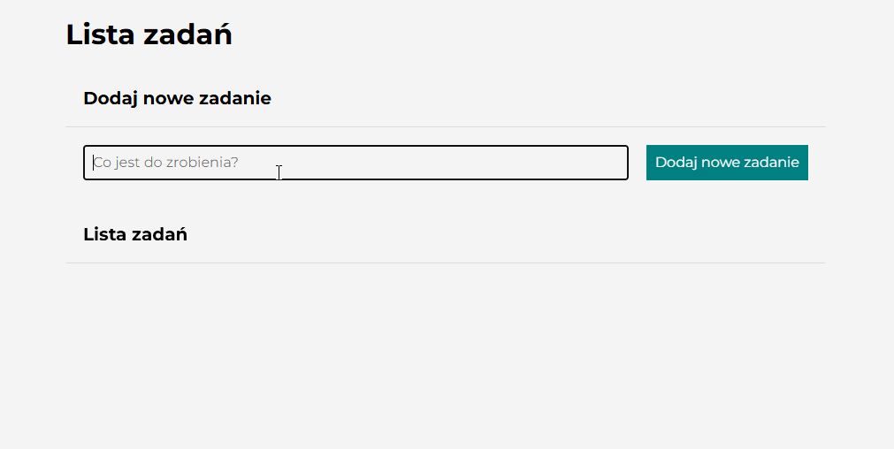

# ToDo List Project

## Description
This is a simple ToDo List web application. You can add tasks, mark them as done, and delete them. The design follows BEM conventions, and the interface includes green checkboxes and red trash icons for task management.

## Functionality
- Add a new task using the input field and the "Add Task" button.
- Mark tasks as done by clicking the green checkbox (task gets a checkmark and is crossed out).
- Delete tasks by clicking the red trash icon.
- Tasks are dynamically added to the list, and the layout is responsive.

## Technologies
- HTML
- CSS (BEM methodology)
- JavaScript

## Learning Points
- DOM manipulation in JavaScript
- Event handling for adding, completing, and deleting tasks
- Using BEM for CSS structure
- Creating responsive layout with sections

## Live Demo
Check the live version of the project here: 
[My ToDo List Website](https://Izabelak75.github.io/to-do-list/) 

## How to Interact

1. Add a task in the input field and click "Add Task".
2. Mark tasks as done with the green checkbox.
3. Delete tasks using the red trash icon.

## Author
**Izabela Kuc** - [my GitHub profile](https://github.com/Izabelak75)